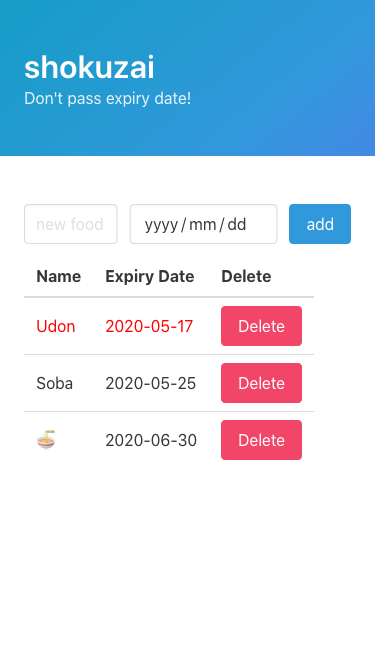

# shokuzai


Expiry date list of my food



## Usage

First, you have to install SQLite. According to [Rocket repository](https://github.com/SergioBenitez/Rocket/tree/master/examples/todo), for example:

- OS X: `brew install sqlite`
- Debian/Ubuntu: `apt-get install libsqlite3-dev`

Then, clone this repository and run Rust program.
If you don't have **nightly** Rust, please install it with `rustup install nightly`.

```bash
git clone https://github.com/yammmt/shokuzai.git
cd shokuzai
cargo run # or `cargo run --release`
```

You can access your site by accessing `http://localhost:8000`.

### CSS

If you want to update CSS file, see the following process.

1. Make sure that you can use Sass from the command line.
1. Clone submodule repository by `git submodule update --init --recursive`.
1. Move to `static` directory.
1. Update `static/mystyles.scss` file.
1. Generate a new `static/css/mystyles.css` file by `sass --sourcemap=none mystyles.scss:css/mystyles.css --style compressed`.

For more Sass information for Bulma, visit [the documentation in Bulma](https://bulma.io/documentation/customize/with-sass-cli/).

## Links

- [Rocket todo example](https://github.com/SergioBenitez/Rocket/tree/master/examples/todo)
    - This app is based on this example :bow:
- CSS framework [Bulma](https://bulma.io/)
